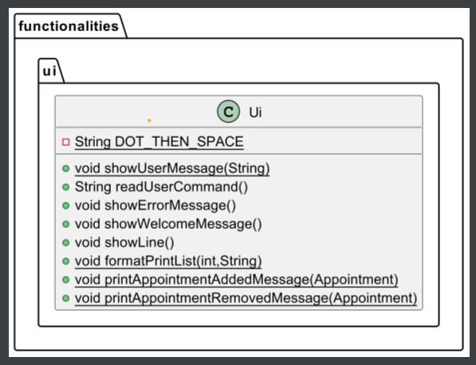
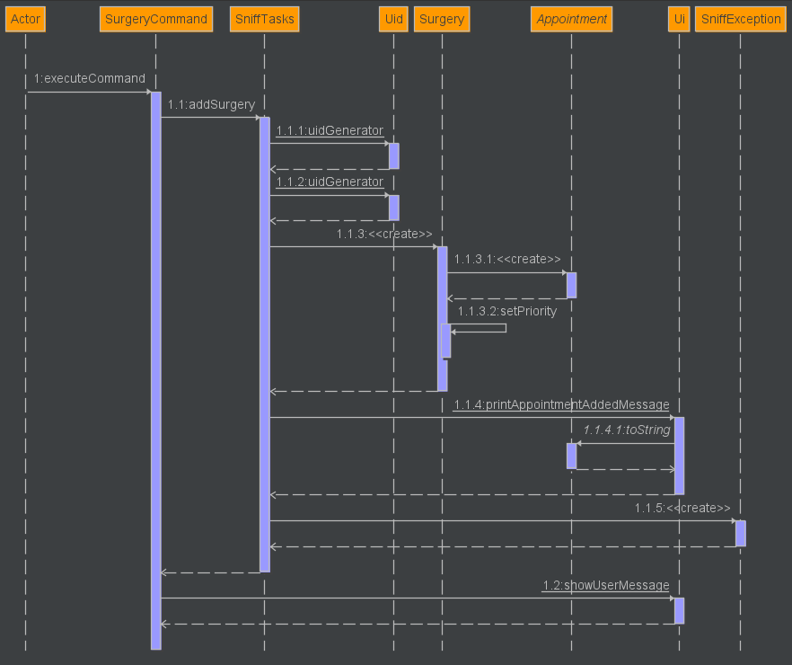

# Developer Guide

## Acknowledgements

{list here sources of all reused/adapted ideas, code, documentation, and third-party libraries -- include links to the original source as well}

## Design & implementation

### User Interface (UI) - Class Implementation
  
**Figure 1: UML Diagram of User Interface (UI) Class**
1. The **`UI class`** named `Ui` belongs to the package functionalities.ui. The class contains several static and non-static methods that display messages to the user such as **`showUserMessage()`**, **`showErrorMessage()`**, and **`showWelcomeMessage()`**. The class is also used to read user input, format and print appointment lists, and add or remove appointments from the **`sniff appointment manager`**. The **`Ui`** class has a **`showLine()`** method that displays a divider line to the user.
2. The **`UI class`** has a private static final String DOT_THEN_SPACE field that is used as a constant string value to format user messages. It has a **`readUserCommand()`** method that returns a string value that is entered by the user through the Command Line Interface (CLI).
3. The class imports the **`SniffException`** class from the exception package and utilizes it in the **`showErrorMessage()`** method to display an error message to the user.

### Command - Class Implementation
  
**Figure 2: UML Diagram of Command Class**

  
**Figure 3: Sequence Diagram showing the logical implementation of executeCommand() for the Consultation Command**

  
**Figure 4: Sequence Diagram showing the logical implementation of executeCommand() for the Vaccination Command**

  
**Figure 5: Sequence Diagram showing the logical implementation of executeCommand() for the Surgery Command**

  
**Figure 6: Sequence Diagram showing the logical implementation of executeCommand() for the Remove Command**

  
**Figure 7: Sequence Diagram showing the logical implementation of executeCommand() for the List Command**

### Parser - Class Implementation
  
Figure 8: UML Diagram of Parser Class
1. The Parser class takes in a user command and generates a corresponding Command object for veterinary management system tasks such as add consultation, vaccination or surgery, find, remove, list, and exit. This implementation makes use of the Command design pattern to encapsulate the behavior of different types of commands, and the parser serves as a factory for creating these commands based on user input.
2. The Parser class contains several static methods that parse different types of commands, such as **`ConsultationCommand`**, **`VaccinationCommand`**, **`SurgeryCommand`**, **`FindCommand`**, **`RemoveCommand`**, **`ListCommand`**, and **`ExitCommand`**.
3. The **`parse()`** method takes a user command as a String named **`task`** and determines the type of command based on the first word of the command. If it matches any of the known command types, it delegates parsing to the corresponding parse method.
4. If the first word of the command does not match any known type, it throws a **`SniffException`**. Each parse method takes the command String as input and uses substring operations to extract the various parameters of the command. It then creates a new Command object with these parameters and assigns it to the "command" static variable.
5. Finally, the parse method returns the command object. If an exception occurs during parsing, it throws a **`SniffException`**.

## Product scope
### Target user profile

{Describe the target user profile}

### Value proposition

{Describe the value proposition: what problem does it solve?}

## User Stories

|Version| As a ... | I want to ... | So that I can ...|
|--------|----------|---------------|------------------|
|v1.0|new user|see usage instructions|refer to them when I forget how to use the application|
|v2.0|user|find a to-do item by name|locate a to-do without having to go through the entire list|

## Non-Functional Requirements

{Give non-functional requirements}

## Glossary

* *glossary item* - Definition

## Instructions for manual testing

{Give instructions on how to do a manual product testing e.g., how to load sample data to be used for testing}
